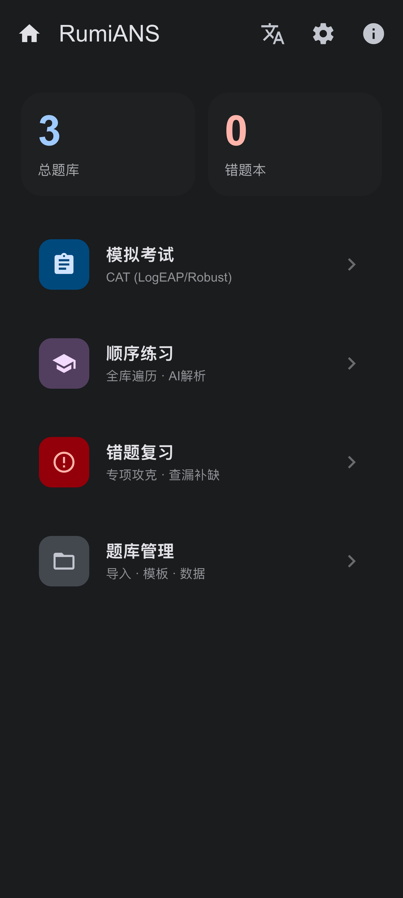
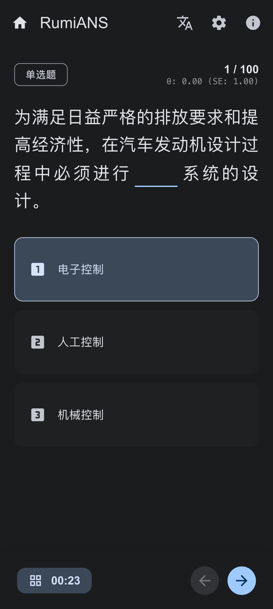
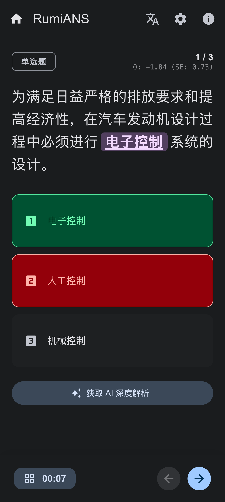
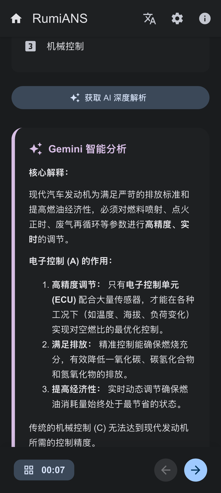
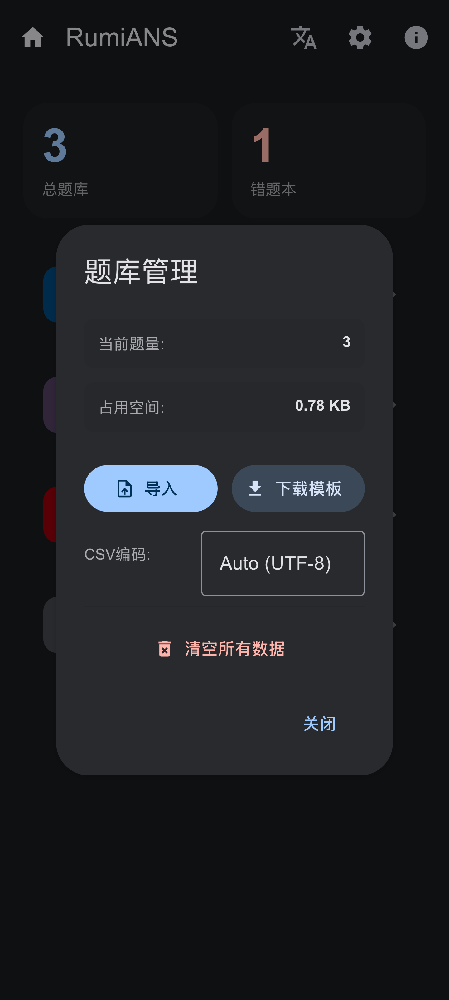

<div align="center">

# RumiANS - Pro Exam System

**下一代轻量级、智能化、纯本地的 Web 考试系统**

[English](./README_EN.md) | [简体中文](./README.md)

---

<div style="display: flex; justify-content: center; gap: 10px;">
    
    
    
    
    
</div>
<br/>

[](LICENSE)
[](https://www.mdui.org/)
[](https://ai.google.dev/)

</div>

**RumiANS** 是一个基于 Web Components 和 Material Design 3 设计构建的单文件考试系统。它集成了先进的项目反应理论 (IRT) 算法用于能力评估，并内置 Google Gemini AI 接口以提供智能题目解析。系统完全运行在浏览器端，无需后端服务器，确保了数据的绝对隐私与安全。

## 目录 (Table of Contents)

- [背景](#背景-background)
- [核心特性](#核心特性-features)
- [安装与使用](#安装与使用-install--usage)
- [题库规范](#题库规范-data-format)
- [配置说明](#配置说明-configuration)
- [技术栈](#技术栈-tech-stack)
- [贡献指南](#贡献指南-contributing)
- [开源许可](#开源许可-license)

## 背景 (Background)

传统的在线考试系统往往依赖复杂的服务器部署，且数据存储在云端，存在隐私泄露风险。同时，大多数简易的刷题工具缺乏科学的评估算法，无法准确衡量用户的真实水平。

RumiANS 旨在解决以下痛点：

* **隐私安全**：所有数据（题库、错题、进度）均存储在本地浏览器 (IndexedDB/LocalStorage)。
* **科学评估**：引入计算机自适应测试 (CAT) 和 IRT 算法，而非简单的百分制。
* **智能辅助**：利用生成式 AI (GenAI) 对错题进行实时、深度的解析。
* **极致便携**：核心代码整合在一个 HTML 文件中，即开即用。

## 核心特性 (Features)

* 🎨 **Material Design 3 界面**：基于 MDUI 2 构建，支持深色模式 (Dark Mode) 自动切换，移动端原生体验。
* 🧠 **智能 IRT 算法**：内置 2-PL/3-PL 模型的高性能浮点数计算引擎，实时估算考生的能力值 ($\theta$)。
* 🤖 **AI 深度解析**：集成 Google Gemini API，为任意题目提供上下文感知的智能解析。
* 🔒 **隐私优先**：采用 LocalStorage + LZ-String 压缩存储，所有数据仅在本地处理。
* 📂 **强大的文件管理**：
    * 支持 Excel (`.xlsx`, `.xls`) 及 CSV 格式导入。
    * 自动识别题目中的括号 `( )` 并进行格式化渲染。
    * 支持多种文件编码 (UTF-8, GBK) 自动识别。

## 安装与使用 (Install & Usage)

由于 RumiANS 是单文件应用 (SPA)，无需复杂的构建过程。

### 快速开始

1.  下载最新版本的 `index.html` 文件。
2.  使用现代浏览器（Chrome, Edge, Safari, Firefox）直接打开该文件。
3.  在主页点击 **"文件管理 (File Manager)"** -> **"导入 (Import)"** 上传您的题库文件。

### 开发环境

如果您需要修改源码：

```bash
# 克隆仓库
git clone [https://github.com/lo3612/lite-exam-system.git](https://github.com/lo3612/lite-exam-system.git)

# 进入目录
cd lite-exam-system

# 推荐使用 Live Server 或类似工具运行，以避免本地文件系统的跨域限制
# 例如使用 npx http-server
npx http-server .
```


## 题库规范 (Data Format)

系统支持 `.xlsx` 或 `.csv` 格式。请确保您的表格包含以下表头（支持模糊匹配）：

| 列名 (Header) | 说明 (Description) | 示例 |
| :--- | :--- | :--- |
| **大题题干** | 题目内容，支持 Markdown 语法 | 摩擦式离合器主要由( )组成。 |
| **正确答案** | 选项的字母代号 | B |
| **选项A** | 选项 A 的内容 | 压紧机构 |
| **选项B** | 选项 B 的内容 | 从动盘 |
| **选项C** | 选项 C 的内容 | 飞轮 |
| **选项D** | 选项 D 的内容 | 扭转减震器 |

> **提示**：您可以在系统内的“文件管理”中点击“下载模板”获取标准 Excel 模板。

## 配置说明 (Configuration)

点击主页右上角的 **设置 (Settings)** 图标进行配置：

* **Google Gemini API Key**：填入您的 API Key 以启用 AI 解析功能。
    * 申请地址：[Google AI Studio](https://aistudio.google.com/)
* **总题数 (Total Questions)**：模拟考试模式下的题目数量。
* **判断题数量 (Judge Count)**：控制生成试卷时判断题的比例（用于内容平衡算法）。

## 技术栈 (Tech Stack)

本项目主要依赖以下开源技术：

* **[MDUI 2](https://www.mdui.org/)** - 下一代 Material Design Web 组件库。
* **[SheetJS (xlsx)](https://sheetjs.com/)** - 强大的电子表格解析库。
* **[Marked](https://marked.js.org/)** - 高性能 Markdown 解析器。
* **[LZ-String](https://github.com/pieroxy/lz-string)** - 基于 LocalStorage 的字符串压缩库。
* **Custom IRT Engine** - 自研工业级高性能心理测量学引擎。
    * **核心模型**：采用 **3-PL (三参数逻辑斯蒂)** 模型，精确评估题目区分度 ($a$)、难度 ($b$) 和猜测系数 ($c$)。
    * **评估与选题**：基于 **EAP (期望后验估计)** 实时计算能力值 ($\theta$)，并利用 **最大费雪信息量 (Fisher Information)** 实现 CAT 自适应选题。
    * **极致性能**：摒弃传统对象数组，采用 **SoA (Struct of Arrays)** 内存布局配合 **Float32Array**，结合**预计算查表法**，在移动端实现 <1ms 的毫秒级运算。
    * **数值稳定**：全程在 **对数域 (Log Domain)** 进行计算，应用 Log-Sum-Exp 技巧防止浮点数溢出或下溢。

## 贡献指南 (Contributing)

非常欢迎社区贡献！请遵循以下步骤：

1.  Fork 本仓库。
2.  创建一个新的分支 (`git checkout -b feature/AmazingFeature`)。
3.  提交您的更改 (`git commit -m 'Add some AmazingFeature'`)。
4.  推送到分支 (`git push origin feature/AmazingFeature`)。
5.  开启一个 Pull Request。

请确保您的代码风格与现有代码保持一致。

## 开源许可 (License)

本项目采用 [MIT 许可证](LICENSE)。

部分引用的第三方库遵循其各自的许可证：
* MDUI 2: MIT
* SheetJS: Apache 2.0
* Marked: MIT
* LZ-String: MIT

---

<div align="center">
<strong>Designed with Material Design 3</strong>
<br/>
Made with ❤️ by lo3612
</div>