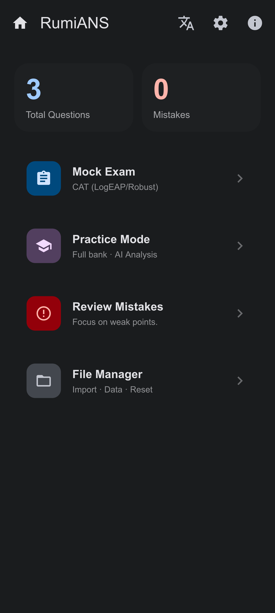
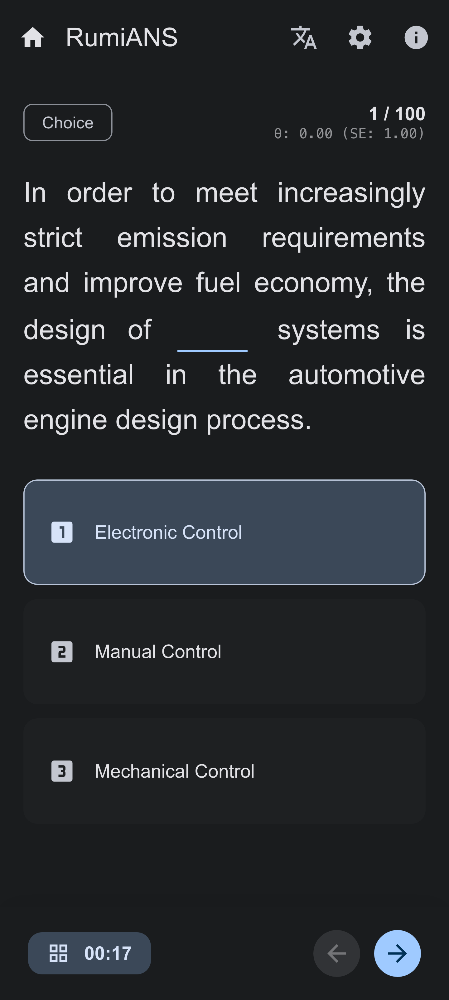
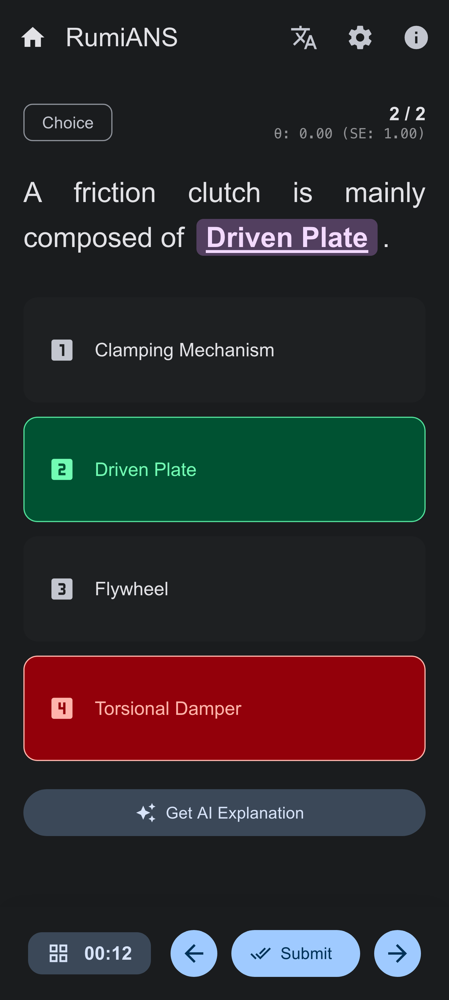
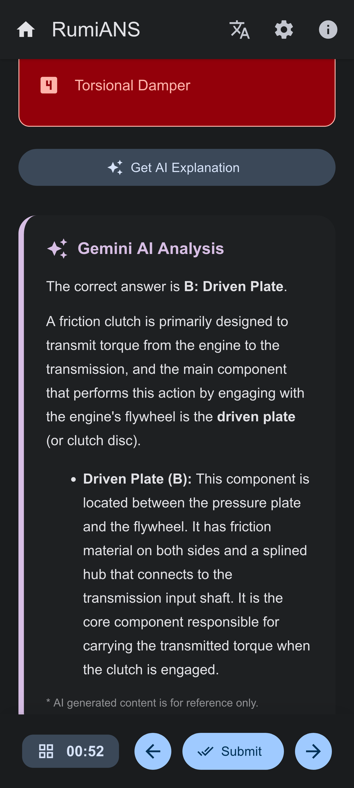
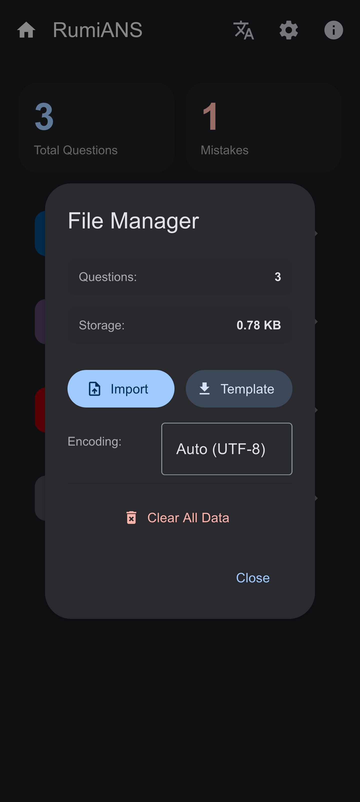

<div align="center">

# RumiANS - Pro Exam System

**Next-Gen Lightweight, Intelligent, Purely Local Web Exam System**

[简体中文](./README.md) | [English](./README_EN.md)

---

<div style="display: flex; justify-content: center; gap: 10px;">
    
    
    
    
    
</div>
<br/>

[](LICENSE)
[](https://www.mdui.org/)
[](https://ai.google.dev/)

</div>

**RumiANS** is a single-file exam system built with Web Components and Material Design 3. It integrates advanced Item Response Theory (IRT) algorithms for capability assessment and features a built-in Google Gemini AI interface for intelligent question analysis. The system runs entirely in the browser without a backend server, ensuring absolute data privacy and security.

## Table of Contents

- [Background](#background)
- [Features](#features)
- [Install & Usage](#install--usage)
- [Data Format](#data-format)
- [Configuration](#configuration)
- [Tech Stack](#tech-stack)
- [Contributing](#contributing)
- [License](#license)

## Background

Traditional online exam systems often rely on complex server deployments and store data in the cloud, posing privacy risks. Meanwhile, most simple quiz tools lack scientific assessment algorithms, failing to accurately measure a user's true proficiency level.

RumiANS aims to solve these pain points:

* **Privacy First**: All data (question banks, mistake logs, progress) is stored locally in the browser (IndexedDB/LocalStorage).
* **Scientific Assessment**: Implements Computerized Adaptive Testing (CAT) and IRT algorithms instead of simple percentage scoring.
* **Intelligent Assistance**: Utilizes Generative AI (GenAI) for real-time, in-depth analysis of incorrect answers.
* **Extreme Portability**: Core code is consolidated into a single HTML file, ready to use out of the box.

## Features

* 🎨 **Material Design 3 Interface**: Built on MDUI 2, supporting automatic Dark Mode switching and a native mobile experience.
* 🧠 **Intelligent IRT Algorithm**: Built-in high-performance floating-point engine for 2-PL/3-PL models to estimate examinee ability ($\theta$) in real-time.
* 🤖 **Deep AI Analysis**: Integrated Google Gemini API provides context-aware intelligent explanations for any question.
* 🔒 **Privacy Secured**: Uses LocalStorage + LZ-String compression; all data is processed locally.
* 📂 **Powerful File Management**:
    * Supports Excel (`.xlsx`, `.xls`) and CSV format imports.
    * Automatically identifies and formats brackets `( )` within questions.
    * Supports automatic recognition of various file encodings (UTF-8, GBK).

## Install & Usage

Since RumiANS is a Single Page Application (SPA), no complex build process is required.

### Quick Start

1.  Download the latest `index.html` file.
2.  Open the file directly using a modern browser (Chrome, Edge, Safari, Firefox).
3.  Click **"File Manager"** -> **"Import"** on the homepage to upload your question bank file.

### Development Environment

If you need to modify the source code:

```bash
# Clone the repository
git clone [https://github.com/lo3612/lite-exam-system.git](https://github.com/lo3612/lite-exam-system.git)

# Enter the directory
cd lite-exam-system

# It is recommended to use Live Server or a similar tool to run it
# to avoid CORS restrictions associated with the local file system.
# For example, using npx http-server:
npx http-server .
```

## Data Format

The system supports `.xlsx` or `.csv` formats. Please ensure your spreadsheet contains the following headers (fuzzy matching is supported):

| Header | Description | Example |
| :--- | :--- | :--- |
| **Question** | Content of the question, supports Markdown. | The friction clutch mainly consists of ( ). |
| **Correct Answer** | The letter code of the correct option. | B |
| **Option A** | Content of Option A. | Pressure mechanism |
| **Option B** | Content of Option B. | Driven disc |
| **Option C** | Content of Option C. | Flywheel |
| **Option D** | Content of Option D. | Torsional damper |

> **Tip**: You can download a standard Excel template by clicking "Download Template" inside the system's "File Manager".

## Configuration

Click the **Settings** icon in the top right corner of the homepage to configure:

* **Google Gemini API Key**: Enter your API Key to enable AI analysis features.
    * Get one here: [Google AI Studio](https://aistudio.google.com/)
* **Total Questions**: The number of questions in the simulated exam mode.
* **Judge Count**: Controls the proportion of True/False questions when generating an exam (used for content balancing algorithms).

## Tech Stack

This project relies on the following open-source technologies:

* **[MDUI 2](https://www.mdui.org/)** - Next-generation Material Design Web Component library.
* **[SheetJS (xlsx)](https://sheetjs.com/)** - Powerful spreadsheet parsing library.
* **[Marked](https://marked.js.org/)** - High-performance Markdown parser.
* **[LZ-String](https://github.com/pieroxy/lz-string)** - LocalStorage-based string compression library.
* **Custom IRT Engine** - In-house industrial-grade high-performance psychometric engine.
    * **Core Model**: Adopts the **3-PL (Three-Parameter Logistic)** model to accurately evaluate item discrimination ($a$), difficulty ($b$), and guessing coefficient ($c$).
    * **Assessment & Selection**: Uses **EAP (Expected A Posteriori)** for real-time ability ($\theta$) estimation and **Maximum Fisher Information** for CAT adaptive question selection.
    * **Extreme Performance**: Abandons traditional object arrays in favor of **SoA (Struct of Arrays)** memory layout combined with **Float32Array**. Coupled with **pre-computed lookup tables**, it achieves <1ms operation speed on mobile devices.
    * **Numerical Stability**: Calculations are performed entirely in the **Log Domain**, applying the Log-Sum-Exp technique to prevent floating-point overflow or underflow.

## Contributing

Contributions are welcome! Please follow these steps:

1.  Fork this repository.
2.  Create a new branch (`git checkout -b feature/AmazingFeature`).
3.  Commit your changes (`git commit -m 'Add some AmazingFeature'`).
4.  Push to the branch (`git push origin feature/AmazingFeature`).
5.  Open a Pull Request.

Please ensure your code style remains consistent with the existing code.

## License

This project is licensed under the [MIT License](LICENSE).

Some third-party libraries used are subject to their respective licenses:
* MDUI 2: MIT
* SheetJS: Apache 2.0
* Marked: MIT
* LZ-String: MIT

---

<div align="center">
<strong>Designed with Material Design 3</strong>
<br/>
Made with ❤️ by lo3612
</div>